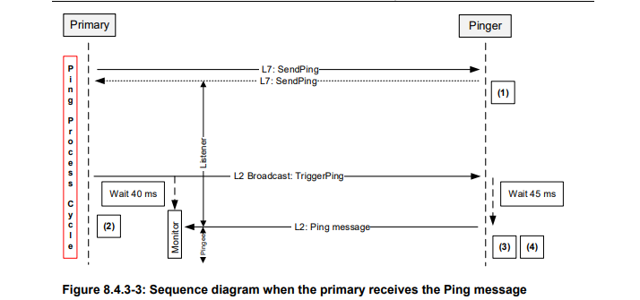
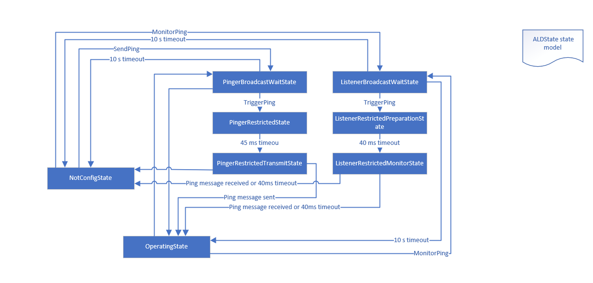

## AISG项目功能描述

#### PING功能简述

AISG v3.0 enables verification of the RF-cable connections in the antenna system by sending
Ping messages between the RF ports of antennas, ALDs and the primary. The method can be
used to diagnose crossed, missing, stolen or broken RF cables by comparing the actual
connections with the site installation plan. This ping process can be used in conjunction with
Site Mapping commands to automatically discover the RF paths.

如图1为主站与ALD设备之间通信顺序图

​																				图	1

如图2为ALD状态切换图

​																				图 2

The ping process commands are:
- MonitorPing : A layer 7 primary command sent to the ALDs selected to listen to the
Ping message. The ALD listeners monitor the requested RF port.
- SendPing : A layer 7 primary command sent to the ALD selected to be the pinger.
- TriggerPing : A layer 2 primary command broadcast to the pinger and ALD listeners.
Upon reception, the pinger sends the Ping message and the listeners monitor the RF
port for the Ping message.
- AbortPing : A layer 7 primary command sent to the pinger and ALD listeners aborting
the ping process cycle.
- A Ping message is a layer 2 message send by the pinger when it receives the
TriggerPing command. 

如上所述：ALD设备可以有两种状态，Linstern 与 Pinger。主站配置ALD设备，发送广播命令（TriggerPing ），pinger广播发送Ping message。

代码简述：配置ALD为pinger

```c
/**
  *@Author EvansLiu sendping command
  *@Date 2019/10/18 11:17
  *@Brief The primary sends a layer 7 SendPing command to the pinger,, specifying the port on which the Ping message shall be transmitted.
  *@Param   
  *@Return 
  */

void AISG_Cmd_SendPing(u16 portIndex, AISG_IFrame *pIFrame) {
    StateAllowedT result;
    u8 PortNumber = *(u16 *) pIFrame->Data;

    if (0 != pIFrame->Subunit) {
        AISGL7_SendFailResponse(portIndex, AISG_CMD_SEND_PING, pIFrame->CommandSequence, InvalidSubunitNumber);
        return;
    }
    if ((PortNumber > ald.nrOfValidPort) || (PortNumber < 1)) {
        AISGL7_SendFailResponse(portIndex, AISG_CMD_SEND_PING, pIFrame->CommandSequence, InvalidPortNumber);
        return;
    }
    if (port[ald.portNumberToIndex[PortNumber]].properties == RFControlPort) {
        port[ald.portNumberToIndex[PortNumber]].properties = RFControlBaseStationPingPort;//Custom modify port permissions 215

    }
    if (TowardsBaseStation != (port[PortNumber - 1].properties & Direction)) {
        AISGL7_SendFailResponse(portIndex, AISG_CMD_SEND_PING, pIFrame->CommandSequence, IncorrectDirection);
        return;
    }
    if (Ping != (port[PortNumber - 1].properties & Ping)) {
        AISGL7_SendFailResponse(portIndex, AISG_CMD_SEND_PING, pIFrame->CommandSequence, IncorrectPortType);
        return;
    }
    port[ald.portNumberToIndex[PortNumber]].properties = RFControlPort;//Rollback port permissions
    if (ald.type == MALD && (PortNumber != portIndex) && (port[PortNumber].linkState == Connected)) {
        AISGL7_SendFailResponse(portIndex, AISG_CMD_SEND_PING, pIFrame->CommandSequence, PortInUse);
        return;

    }
    eConnectionState AcceptedStates[1] = {OperatingConnectionState};
    result = IsStateChangeAllowed(AcceptedStates, 1, pIFrame->Command, portIndex);
    if (!result.allowed) {
        AISGL7_SendFailResponse(portIndex, AISG_CMD_SEND_PING, pIFrame->CommandSequence, result.code);
        return;
    }

    ald.pingPrimaryID = *(u32 *) (pIFrame->Data + 2);//Record PrimaryID
    AISGL7_BeginResponse(portIndex, AISG_CMD_SEND_PING, pIFrame->CommandSequence, OK);
    AISGL7_SendBuiltResponse(portIndex);
    ald.stateBackup = ald.state;//Record current ald state
    for (u16 i = 0; i < AISG_MAX_PORT_COUNT; i++) {
        if (i == portIndex) continue;
        port[i].connectionState = RestrictedConnectionState;
    }
    port[portIndex].connectionState = PingerConnectionState;
    ald.PingRFPort = *(u16 *) pIFrame->Data;
    ald.state = PingerBroadcastWaitState;
    ald.Flags.PendingConnectionStateChange = false;
    /**
     * Initiate PingTimer at 10 seconds
     */
    ald.pingerTimer.started = true;
    ald.pingerTimer.timer = Timer_GetTickCount();
    ald.pingerTimer.timerDelay = 10000;

    CommandExit(pIFrame->Command, portIndex);
}
```

